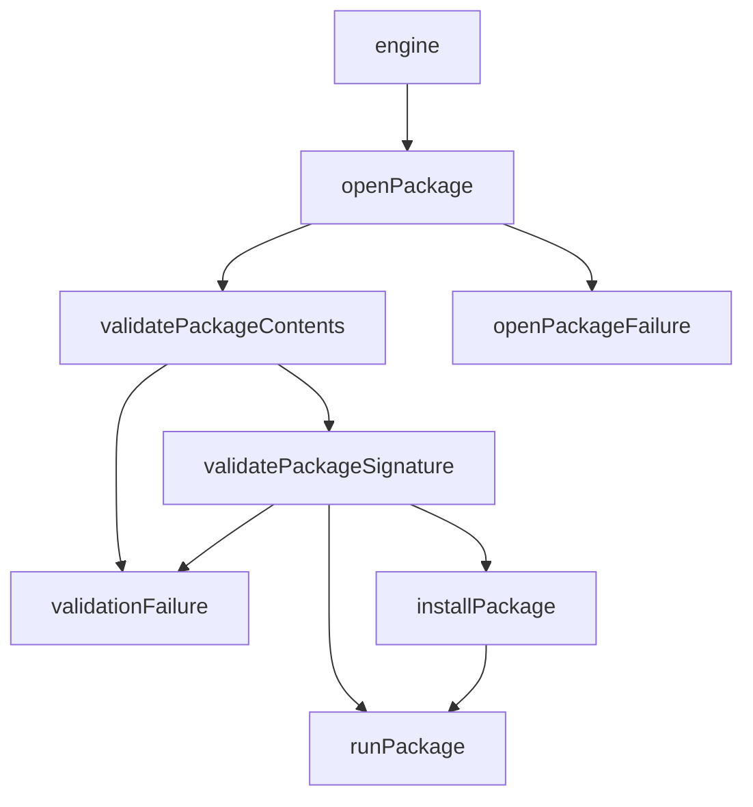

# FUEL Operation

This is the required order of operations when running a FUEL package.

# 1. Package extraction and validation
There are two options for handling this - immediate and lazy. The immediate option is easier to implement but more costly if the validation fails.

## Immediate

- Extract the [package](fuel-package-layout.md) fully to disk
- Validate the layout of the extracted package
- Validate the [signature](fuel-package-signature.md) for all files in the extracted package
- If validation succeeded, proceed with the next step.

## Lazy

- Extract the [signature manifest](fuel-package-signature.md) only
- Validate that every file in the package is listed in the signature manifest. If not, validation fails.
- Validate that every file listed in the signature manifest is in the package. If not, validation fails.
- For each file listed in the signature manifest
  - Extract the file
  - Digest the entire file using SHA-256
  - Compare against the digest contained in the signature manifest
  - If comparison fails, validation has failed.

These operations may be done in parallel and lazily to the extent possible
  - The package is extracted.

1. The manifest and signature are extracted from the package.
2. The package contents are verified using the manifest and signature.
3. The list of servers is read from the manifest. There must be at least one active server.
4. For each active server:
   1. The content is decrypted as needed. This is a one time action.
   2. Any security permissions needed are requested (TBD).
   3. A server port is chosen, either based on the manifest or at random.
   4. The server is started on the chosen port.
   5. The URL for the server is written to the console
   6. The server responds to requests on the chosen port until being stopped.

## Service launching

Services are launched with the port assigned in the manifest, or if one is not provided with a random port in the range TBD. If the "visibility" of the server is marked as "private" the URL for talking to the server is not echoed to the std output. ***In this case it can be retrieved by other services launched from the same package using the "service" API.***
